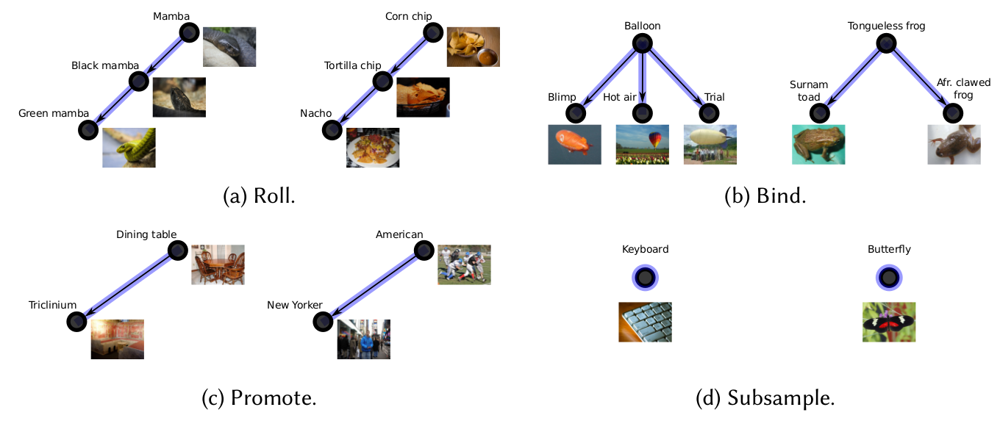

# Shuffled ImageNet-Banks for Video Event Detection and Search
This repository contains pre-trained models, wordnet ids, and a simple feature extraction script for the paper "Shuffled ImageNet-Banks for Video Event Detection and Search".
<br>
This paper is accepted for publication in the Transactions on Multimedia Computing Communications and Applications (TOMM).
<br><br>
<center>

</center>
<br><br>
The repository includes:

* Download script for pre-computed MxNet models.
* Script to obtain fully-connected or softmax representations for an individual frame.
* WordNet ids for the concepts used in different models.

## Used software

* Python 3.7.4
* MxNet 1.6.0
* Numpy 1.17.2
* nltk 3.4.5 (optional)

## Downloading the pre-trained models

The pre-trained models can be obtained by executing the bash script:
```
bash get_models.sh
```
The bash script makes a directory 'models' and downloads the bottom-up networks with 12,988 and 4,437 concepts, as well as the top-down network with 4,000 concepts.

## Feature extraction

Features at the fully-connected or softmax layer can be extracted with the example script. For example:
```
python mxnet_frame_representation.py data/example-frame.jpg models/resnext101_bottomup_12988/ prob data/wnids_bottomup_12988.txt
```
The above script extracts features for the example frame in the 'data' folder using the pre-trained bottom-up network with 12,988 concepts. The output is:
```
Obtained features: (12988,)
Top 5 concepts with scores:
Synset('warhorse.n.03') : 0.4759
Synset('polo.n.02') : 0.1611
Synset('polo_pony.n.01') : 0.0445
Synset('polo_mallet.n.01') : 0.0439
Synset('shield.n.02') : 0.0354
```

If you use the models or extraction script, please cite the paper accordingly:
```
@article{mettes2020shuffled,
  title={Shuffled ImageNet-Banks for Video Event Detection and Search},
  author={Mettes, Pascal and Koelma, Dennis C and Snoek, Cees G M},
  journal={Transactions on Multimedia Computing Communications and Applications},
  year={2020},
  publisher={ACM}
}
```
